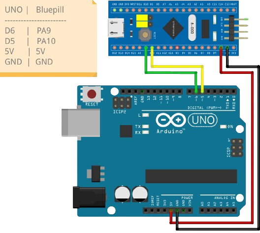

# N2CMU (Neural Network Coprocessing Microcontroller Unit)

N2CMU is a project aimed at implementing a neural network coprocessing microcontroller unit (MCU) for STM32F103C8T6 Bluepill development board using the TinyGo (Go programming language for embedded systems). This MCU enables offloading feedforward neural network computations to a dedicated hardware unit, allowing for efficient and low-power feedforward neural network training and inference on small hardware embedded systems.

## Features

- **Neural Network Coprocessing**: N2CMU allows offloading feedforward neural network computations to a dedicated coprocessing unit, freeing up the main microcontroller for other tasks.
- **UART Communication**: Communication with N2CMU is facilitated via UART, enabling external devices to control and interact with the coprocessing unit.
- **Flexible Configuration**: N2CMU supports dynamic configuration of neural network parameters such as input, hidden, and output neuron counts, as well as weights, biases, and gradients.
- **Training and Inference**: The coprocessing unit supports both training and inference modes, allowing for the optimization of neural network models directly on the microcontroller.

## Getting Started

### Prerequisites

To run N2CMU on your STM32F103C8T6 Bluepill development board, you'll need:

1. STM32F103C8T6 Bluepill development board
2. ST-Link v2
3. [TinyGo compiler](https://tinygo.org/getting-started/install/)
4. [Qrepo](https://github.com/nthnn/Qrepo) package manager

### Installation

1. Clone the N2CMU repository to your local machine:

```bash
git clone https://github.com/nthnn/n2cmu.git
```

2. Connect your STM32F103C8T6 Bluepill development board to your computer using a USB to UART converter.

3. Flash the code to your STM32F103C8T6 Bluepill development board using your ST-Link v2:

```bash
cd n2cmu
qrepo run flash
```

4. You're now ready to interact with N2CMU and start utilizing its neural network coprocessing capabilities. Follow the example schematic below for Arduino UNO (but other boards will do).

<p align="center">
    
</p>

5. Alternatively, you can manufacture your own Arduino UNO shield for N2CMU. Here's the Gerber file and PDF schematic file for N2CMU shield:

    - [Arduino N2CMU shield PDF schematic](pcb/Arduino-N2CMU-Shield-Schematic.pdf)
    - [Arduino N2CMU Gerber file](pcb/Arduino-N2CMU-Shield-Gerber.zip)

6. See [n2cmu-arduino](https://github.com/nthnn/n2cmu-arduino) library for interacting with Arduino-powered boards.

## Contributing

Contributions to N2CMU are highly encouraged and appreciated! To contribute new features, bug fixes, or enhancements, please adhere to the following guidelines:

1. Fork the N2CMU repository.
2. Create a new branch for your changes: `git checkout -b feature-name`.
3. Implement your changes and commit them: `git commit -m "Added new feature"`.
4. Push your changes to the branch: `git push origin feature-name`.
5. Submit a pull request for review and inclusion.

## License

Copyright (c) 2024 Nathanne Isip

N2CMU is distributed under the GNU General Public License v3.0. For further details, refer to the [LICENSE](LICENSE) file.

```
This program is free software: you can redistribute it and/or modify  
it under the terms of the GNU General Public License as published by  
the Free Software Foundation, version 3.

This program is distributed in the hope that it will be useful, but 
WITHOUT ANY WARRANTY; without even the implied warranty of 
MERCHANTABILITY or FITNESS FOR A PARTICULAR PURPOSE. See the GNU 
General Public License for more details.

You should have received a copy of the GNU General Public License 
along with this program. If not, see <http://www.gnu.org/licenses/>.
```
